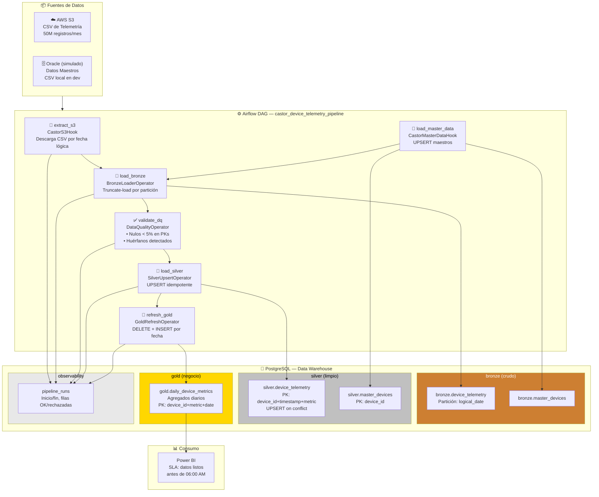

```mermaid
flowchart TD
    subgraph SOURCES["📦 Fuentes de Datos"]
        S3["☁️ AWS S3\nCSV de Telemetría\n50M registros/mes"]
        ORACLE["🗄️ Oracle (simulado)\nDatos Maestros\nCSV local en dev"]
    end

    subgraph AIRFLOW["⚙️ Airflow DAG — castor_device_telemetry_pipeline"]
        direction TB
        T1["🔽 extract_s3\nCastorS3Hook\nDescarga CSV por fecha lógica"]
        T2["🔽 load_master_data\nCastorMasterDataHook\nUPSERT maestros"]
        T3["🥉 load_bronze\nBronzeLoaderOperator\nTruncate-load por partición"]
        T4["✅ validate_dq\nDataQualityOperator\n• Nulos < 5% en PKs\n• Huérfanos detectados"]
        T5["🥈 load_silver\nSilverUpsertOperator\nUPSERT idempotente"]
        T6["🥇 refresh_gold\nGoldRefreshOperator\nDELETE + INSERT por fecha"]

        T1 --> T3
        T2 --> T3
        T3 --> T4
        T4 --> T5
        T5 --> T6
    end

    subgraph POSTGRES["🐘 PostgreSQL — Data Warehouse"]
        subgraph BRONZE["bronze (crudo)"]
            B1["bronze.device_telemetry\nPartición: logical_date"]
            B2["bronze.master_devices"]
        end
        subgraph SILVER["silver (limpio)"]
            S1["silver.device_telemetry\nPK: device_id+timestamp+metric\nUPSERT on conflict"]
            S2["silver.master_devices\nPK: device_id"]
        end
        subgraph GOLD["gold (negocio)"]
            G1["gold.daily_device_metrics\nAgregados diarios\nPK: device_id+metric+date"]
        end
        subgraph OBS["observability"]
            O1["pipeline_runs\nInicio/fin, filas OK/rechazadas"]
        end
    end

    subgraph BI["📊 Consumo"]
        PBI["Power BI\nSLA: datos listos\nantes de 06:00 AM"]
    end

    SOURCES --> AIRFLOW
    T3 --> B1
    T2 --> B2
    T5 --> S1
    T2 --> S2
    T6 --> G1
    T1 & T3 & T4 & T5 & T6 --> O1
    G1 --> PBI

    style BRONZE fill:#cd7f32,color:#fff
    style SILVER fill:#c0c0c0,color:#000
    style GOLD fill:#ffd700,color:#000
    style OBS fill:#e8e8e8,color:#000
```